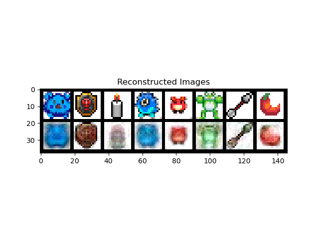
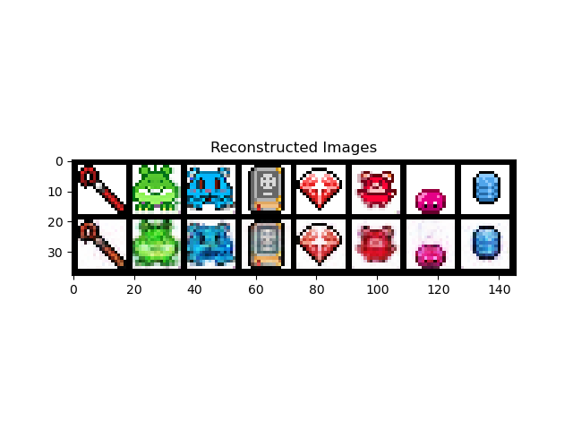
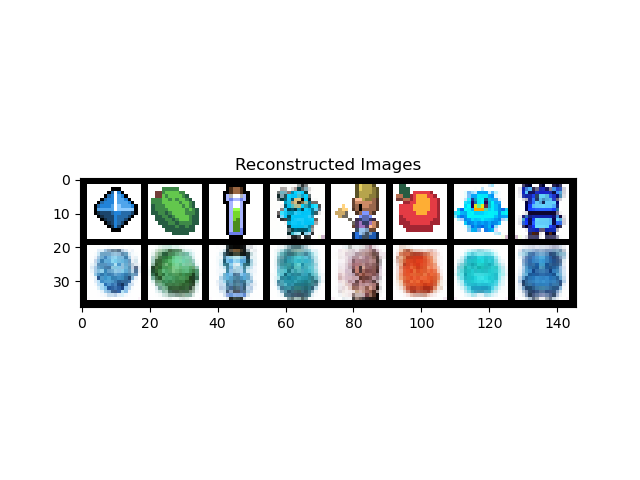
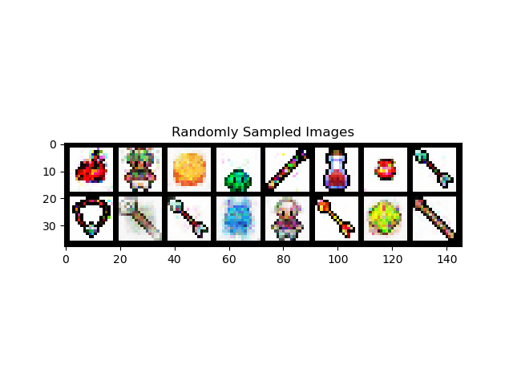
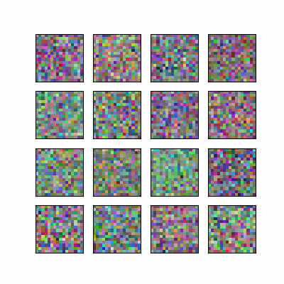

# Image Generator

This project is an image generation tool that uses various deep learning models to generate images. The project includes implementations of different models such as Autoencoder, Convolutional Autoencoder, Variational Autoencoder (VAE), Generative Adversarial Network (GAN), and Diffusion Model. The dataset used for training these models is a pixel art dataset.

## Getting Started

### Prerequisites

- Python 3.7 or higher
- PyTorch
- Kaggle API

### Installation

1. Clone the repository:
   ```bash
   git clone https://github.com/JorgeVanco/image-generator.git
   cd image-generator
   ```

2. Install the required packages:
   ```bash
   pip install -r requirements.txt
   ```

3. Download the dataset: 
   It is automatically downloaded when running the script if the dataset is not found in the data-dir
   ```bash
   python src/train.py --gpu --data-dir dataset -m <model_name>
   ```

## Available Models

- Autoencoder
- Convolutional Autoencoder
- Variational Autoencoder (VAE)
- Generative Adversarial Network (GAN)
- Diffusion Model

## Dataset

The dataset used in this project is a pixel art dataset. It can be downloaded using the Kaggle API.

## Running the Code

To train a model, use the following command:

```bash
python src/train.py --verbose --gpu --data-dir dataset -m <model_name> --batch 256 --epochs 1
```

Replace `<model_name>` with one of the available models: `autoencoder`, `conv_autoencoder`, `vae`, `gan`, `diffusion`.

### Examples

1. Train an Autoencoder:
   ```bash
   python src/train.py --verbose --gpu --data-dir dataset -m autoencoder --batch 256 --epochs 200
   ```

   Example output from Autoencoder:
   

2. Train a Convolutional Autoencoder:
   ```bash
   python src/train.py --verbose --gpu --data-dir dataset -m conv_autoencoder --batch 256 --epochs 200
   ```

   Example output from Convolutional Autoencoder:
   


3. Train a Variational Autoencoder (VAE):
   ```bash
   python src/train.py --verbose --gpu --data-dir dataset -m vae --batch 256 --epochs 500
   ```

   Example output from VAE:
   

4. Train a GAN:
   ```bash
   python src/train.py --verbose --gpu --data-dir dataset -m gan --batch 256 --epochs 100
   ```

   Example output from GAN:
   

5. Train a Diffusion Model:
   ```bash
   python src/train.py --verbose --gpu --data-dir dataset -m diffusion --batch 256 --epochs 32 --weight-decay 0
   ```

   Example output from Diffusion model:
   
   

7. Use TensorBoard or Weights & Biases to visualize training:
   ```bash
   python src/train.py --verbose --gpu --writer tensorboard --data-dir dataset -m diffusion --batch 256 --epochs 100
   python src/train.py --verbose --gpu --writer wandb --data-dir dataset -m diffusion --batch 256 --epochs 100
   ```

8. Use different learning rate schedulers:
   ```bash
   python src/train.py --data-dir dataset -m diffusion --scheduler linear
   python src/train.py --data-dir dataset -m diffusion --scheduler cosine
   ```

Replace `<model_name>` with the name of the model you trained.

## Contributing

Contributions are welcome! Please open an issue or submit a pull request for any improvements or bug fixes.

## License

This project is licensed under the MIT License.
